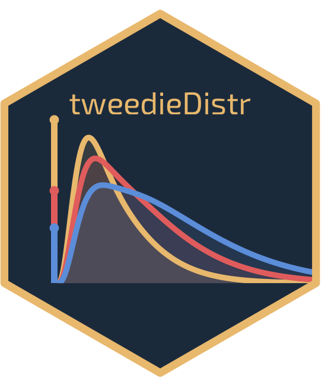

<!-- README.md is generated from README.Rmd. Please edit that file -->

# tweedieDistr: fast evaluation of the Tweedie distribution <a href="https://github.com/StefanoDamato/tweedieDistr/"></a>

<!-- badges: start -->

[](https://github.com/StefanoDamato/tweedieDistr/actions/workflows/R-CMD-check.yaml)
[](https://CRAN.R-project.org/package=tweedieDistr)
[](https://lifecycle.r-lib.org/articles/stages.html#experimental)
[](https://opensource.org/licenses/MIT)
<!-- badges: end -->

`tweedieDistr` provides density, distribution function, quantile
function, and random generation for the **Tweedie distribution** under
the compound Poisson-Gamma parameterisation with power parameter
$p \in (1, 2)$. A
[`distributional`](https://github.com/mitchelloharawild/distributional)-compatible
constructor is also provided for use in tidy modelling workflows. The
Tweedie family naturally combines a point mass at zero with a continuous
positive component, making it well suited to intermittent demand data
and any setting where exact zeros occur alongside strictly positive
observations.

## Exported functions

We provide four `stats`-like functions:

- `dtweedie()`: probability density function via the series expansion of
  Dunn & Smyth (2005).
- `ptweedie()`: cumulative distribution function using a truncated
  compound Poisson-Gamma summation.
- `qtweedie()`: quantile function via Newton-Raphson algorithm, with a
  fallback to bisection.
- `rtweedie()`: random generation via the exact compound Poisson–Gamma
  representation.

We also provide a single constructor for a
[`distributional`](https://github.com/mitchelloharawild/distributional)
object:

- `dist_tweedie()`: create the vectorised object for the Tweedie
  distribution. It supports the standard `distributional` interface:
  `density()`, `CDF()`, `quantile()`, `generate()`, `mean()`,
  `variance()`, `distributional::skewness()`,
  `distributional::kurtosis()`, and `distributional::support()`.

## Installation

You can install the **stable** version from CRAN:

``` r
install.packages("tweedieDistr")
```

You can install the **development** version from
[GitHub](https://github.com/StefanoDamato/tweedieDistr):

``` r
# install.packages("devtools")
devtools::install_github("StefanoDamato/tweedieDistr")
```

## Usage

### Standard `stats`-style interface

The four `dtweedie` / `ptweedie` / `qtweedie` / `rtweedie` functions
mirror the conventions of base R distribution functions and support
vectorised arguments.

``` r
library(tweedieDistr)

# density at a few points
dtweedie(c(0, 1, 2, 3), mean = 1, dispersion = 2, power = 1.2)
#> [1] 0.53526143 0.18138057 0.14514878 0.07404391

# cumulative probabilities
ptweedie(c(0, 1, 2, 3), mean = 1, dispersion = 2, power = 1.2)
#> [1] 0.5352614 0.6168058 0.7952006 0.9014508

# quantiles
qtweedie(c(0.25, 0.5, 0.75, 0.9), mean = 1, dispersion = 2, power = 1.2)
#> [1] 0.000000 0.000000 1.713588 2.980538

# random samples
rtweedie(4, mean = 1, dispersion = 2, power = 1.2)
#> [1] 0.000000 1.775823 0.000000 2.885415
```

### `distributional` interface

`dist_tweedie()` creates a fully-featured `distributional` object,
compatible with tidy modelling frameworks such as
[`fable`](https://fable.tidyverts.org/).

``` r
library(tweedieDistr)

d <- dist_tweedie(mean = 1, dispersion = 2, power = 1.2)
d
#> <distribution[1]>
#> [1] Tweedie(1, 2, 1.2)

# moments
mean(d)
#> [1] 1
distributional::variance(d)
#> [1] 2
distributional::skewness(d)
#> [1] 1.697056
distributional::kurtosis(d)
#> [1] 3.36

# support
distributional::support(d)
#> <support_region[1]>
#> [1] [0,Inf)

# density and CDF
density(d, at = c(0, 1, 2, 3))
#> [[1]]
#> [1] 0.53526143 0.18138057 0.14514878 0.07404391
distributional::cdf(d, q = c(0, 1, 2, 3))
#> [[1]]
#> [1] 0.5352614 0.6168058 0.7952006 0.9014508

# quantiles
quantile(d, p = c(0.25, 0.5, 0.75, 0.9))
#> [[1]]
#> [1] 0.000000 0.000000 1.713588 2.980538

# random generation
distributional::generate(d, times = 4)
#> [[1]]
#> [1] 1.274467 0.000000 0.000000 0.000000
```

`dist_tweedie()` supports vectorised arguments, so a whole column of
distribution objects can be constructed at once; this is crucial as it
allows to use the distribution in the [tidyverts](https://tidyverts.org)
forecasting pipelines, for instance.

``` r
library(tweedieDistr)

dist_tweedie(
  mean       = c(1, 2, 0.5),
  dispersion = c(2., 0.5, 1),
  power      = c(1.2, 1.8, 1.5)
)
#> <distribution[3]>
#> [1] Tweedie(1, 2, 1.2)   Tweedie(2, 0.5, 1.8) Tweedie(0.5, 1, 1.5)
```

## Mathematical background

The Tweedie distribution $$Y \sim \mathrm{Tw}(\mu, \phi, \rho)$$ with
power $p \in (1, 2)$ is a compound Poisson-Gamma variable:
$Y = \sum_{i=1}^{N} G_i$, where

$$N \sim \mathrm{Poisson}(\lambda), \qquad
G_i \sim \mathrm{Gamma}(\alpha, \beta),$$

with

$$\lambda = \frac{\mu^{2-p}}{\phi(2-p)}, \quad
\alpha = \frac{2-p}{p-1}, \quad
\beta = \frac{1}{\phi(p-1)\mu^{p-1}}.$$

The distribution has mean $\mu$ and variance $\phi\mu^p$. When $N = 0$
the sum is conventionally defined as zero, giving a point mass
$P(X = 0) =
e^{-\lambda}$. The density for $x > 0$ is evaluated via the series
expansion of Dunn & Smyth (2005), implemented in C++ through
[Rcpp](https://www.rcpp.org/) and
[RcppArmadillo](https://github.com/RcppCore/RcppArmadillo).

## Contributors

<!-- prettier-ignore-start -->

<!-- markdownlint-disable -->

<table>

<tbody>

<tr>

<td align="center" valign="top" width="20%">

<a href="#">
<br />
<sub><b>Stefano Damato</b></sub></a><br /> <sub>(Maintainer)</sub><br />
<a href="mailto:stefano.damato@supsi.ch?subject=[tweedieDistr package]">Email</a>
</td>

</tr>

</tbody>

</table>

<!-- markdownlint-restore -->

<!-- prettier-ignore-end -->

## Getting help

If you encounter a bug, please file a minimal reproducible example on
[GitHub](https://github.com/StefanoDamato/tweedieDistr/issues).

## References

Dunn, P. K., & Smyth, G. K. (2005). Series evaluation of Tweedie
exponential dispersion model densities. *Statistics and Computing*,
15(4), 267–280. <https://doi.org/10.1007/s11222-005-4070-y>.
